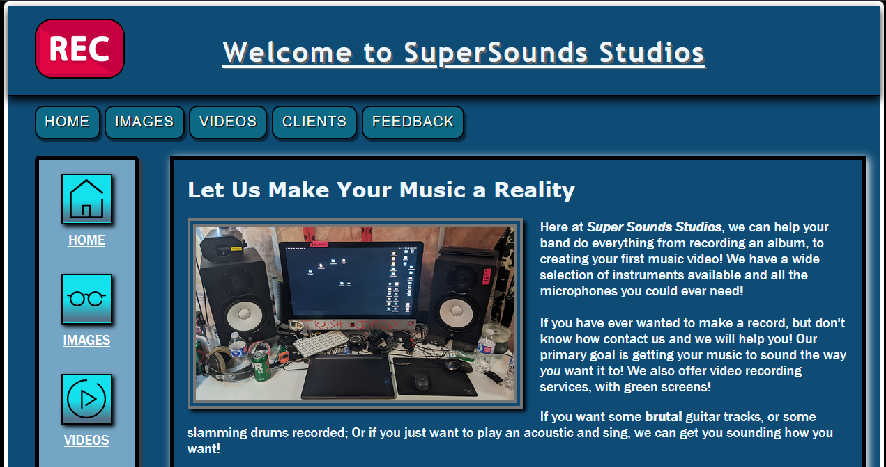

# Super Sounds Studios
My first website to use CSS!

This was for an assignment, and it was fun to make. CSS is pretty powerful, but web dev is obviously not one of my best skills.

[Click here to the view website without downloading it](https://htmlpreview.github.io/?https://github.com/chriswickens/SuperSoundsStudios/blob/master/index.html)

Note: Not all links work properly using this link. It's just a byproduct of how the site is displayed.

